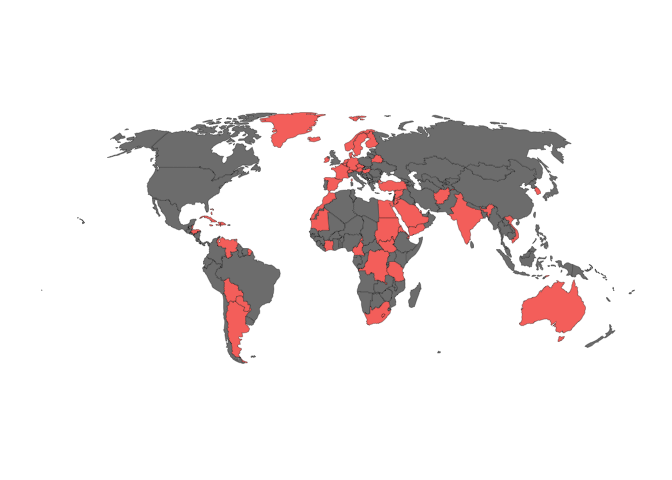

Missing ambassadors in the Trump administration
===============================================

[Andrew Heiss](https://www.andrewheiss.com) • 2017-08-09

``` r
library(tidyverse)
library(stringr)
library(countrycode)
library(rgdal)
```

``` r
countries.map <- readOGR("input/ne_110m_admin_0_countries/", 
                         "ne_110m_admin_0_countries", 
                         verbose = FALSE)

countries.robinson <- spTransform(countries.map, CRS("+proj=robin"))

countries.ggmap <- ggplot2::fortify(countries.robinson, region = "iso_a3") %>%
  filter(!(id %in% c("ATA", -99))) %>%  # Get rid of Antarctica and NAs
  mutate(id = ifelse(id == "GRL", "DNK", id))  # Greenland is part of Denmark
```

The list of ambassadorial appointments (as of 2017-08-09) came from <http://www.afsa.org/list-ambassadorial-appointments>. It's contained in the HTML table defined by this XPath: `//*[@id="node-130"]/div/div/div/div/table`

``` r
ambassadors.raw <- read_csv("input/ambassadors.csv")

vacancies <- ambassadors.raw %>%
  filter(str_detect(Ambassador, "VACANT|NOMINATED")) %>%
  mutate(Post = recode(Post,
                       `Switzerland & Liechtenstein` = "Switzerland",
                       `Mauritius & Seychelles` = "Mauritius",
                       `France & Monaco` = "France",
                       `Spain & Andorra` = "Spain")) %>%
  mutate(iso3 = countrycode(Post, "country.name", "iso3c")) %>%
  filter(!is.na(iso3)) %>%
  mutate(missing = TRUE)
```

``` r
countries.to.plot <- countries.ggmap %>%
  distinct(id) %>%
  left_join(vacancies, by = c("id" = "iso3")) %>%
  mutate(missing = ifelse(id == "RUS", NA, missing))
```

``` r
# Basic blank theme for the map
theme_map <- function(base_size = 12, base_family = "Source Sans Pro") {
  ret <- theme_bw(base_size, base_family) + 
    theme(panel.background = element_rect(fill = "#ffffff", colour = NA),
          panel.border = element_blank(), axis.line = element_blank(),
          panel.grid = element_blank(), axis.ticks = element_blank(),
          axis.title = element_blank(), axis.text = element_blank())
  ret
}

plot.vacancies <- ggplot(countries.to.plot) +
  geom_map(aes(map_id = id, fill = missing), map = countries.ggmap, colour = "black", size = 0.1) +
  expand_limits(x = countries.ggmap$long, y = countries.ggmap$lat) +
  guides(fill = FALSE) +
  coord_equal() +
  theme_map()
plot.vacancies
```



``` r
# Save the plot with Cairo so fonts embed in the PDF and so the PNG uses the right resolution
width <- 8
height <- 4.5

ggsave(plot.vacancies, filename="output/vacancies.pdf",
       width=width, height=height, units="in", device=cairo_pdf)
ggsave(plot.vacancies, filename="output/vacancies.png",
       width=width, height=height, units="in", type="cairo", dpi=300)
```
